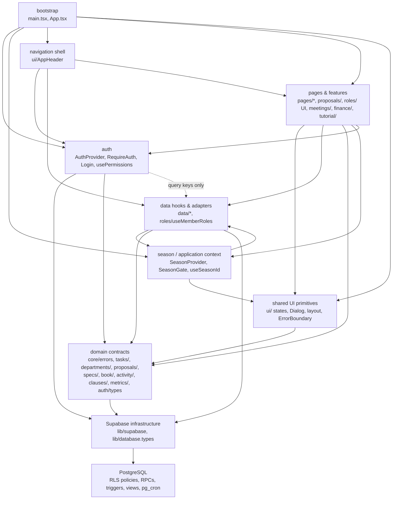

# Reqon architecture

How the code is split, which module owns what, and the guarantees each part
makes. Written from the code as of Phase 11 (2026-09-27); when this disagrees
with the code, the code wins — fix this file.

## 1. Layers and dependency direction

Arrows are runtime imports. `shell --> pages` is the header reading the
tutorial context (`tutorial/`). `domain --> infra` is type-only: each small
domain module's own `types.ts` (`tasks/`, `departments/`, `proposals/`,
`specs/`, `book/`, `activity/`) names generated row types from
`lib/database.types.ts`, and `core/errors.ts` builds `DataError` from a
`PostgrestError`. Nothing imports "upward":

- no page, UI or feature component imports `lib/supabase.ts` — only `data/`,
  `auth/`, `roles/useMemberRoles.ts` and `main.tsx` do;
- `auth/` does not import `pages/` (the sign-in form lives in `auth/Login.tsx`);
- pure models (`pages/*/…Model.ts`) and the small domain module folders
  (`tasks/`, `departments/`, `proposals/`, `specs/`, `book/`, `activity/`)
  import domain types, never a `data/` module or a `use*()` hook from
  anywhere — `TutorialProvider.tsx` (a feature component, not a domain
  module) is what actually calls `useTaskActor()` to learn Head status;
- Supabase's own `User`/`Session`/`AuthError`/`PostgrestError` stop at the
  `auth/` and `data/`/`core/` boundaries. Feature code sees
  `AuthenticatedUser` (`auth/types.ts`) and `DataError` (`core/errors.ts`).

`npm run lint` runs `scripts/check-boundaries.mjs` — a dependency-free
regex-based check (no `madge`, no AST parser; ADR-0011) that enforces exactly
the three rules above (`lib/supabase` import allowlist, pure-module purity,
no import cycle) over every file under `src/`. It currently passes at 250
files, no violations.

**The database is the authorization boundary.** `usePermissions()`
(`auth/permissions.ts`) decides what the UI *offers* from a person's
privileged role; `auth/permissions.ts`'s `TaskActor`-based functions
(`canEditTask`, `canReassignTaskOwner`, `canArchiveTask`, `canReviewProposal`,
`canSubmitProposal`) decide what it offers for a specific task or proposal,
taking the actor **and** the resource together — Department Head authority
(ADR-0003) is resource-aware and does not come from any privileged role. RLS
policies and the RPCs' own checks decide what actually happens, in both
cases; every rule is tested against a real Postgres in `supabase/tests/`.

## 2. Season lifecycle

1. `SeasonProvider` runs one query, `useCurrentSeason()`, against the
   `v_current_season` view (`security_invoker`, so signed-out callers see
   nothing).
2. It exposes one of four states (`season/context.ts`): `loading`, `ready`
   (with `seasonId`), `no-current-season`, `failed`. A failed query is never
   shown as "no season" or as an empty list.
3. `SeasonGate` wraps every season-scoped route and renders loading / error
   (with retry) / "no current season, go to Settings" instead of the page.
   Settings is outside the gate — it is where a season gets created.
4. Hooks read the id with `useSeasonId()` (`undefined` unless `ready`).
   Season-scoped reads go through `useSeasonScopedQuery`, which will not fire
   without an id. Mutations take the id from the same boundary — never from a
   list query. Inserts refuse to write without one; edits address an existing
   row by its own id.
5. Switching is `set_current_season()` — one transaction. The partial unique
   index `seasons_one_current` makes a second current season impossible
   even for a caller bypassing the RPC.

`season_id` appears only in `src/data/` and `src/season/`; screens never
handle it directly — the exception is the season-checked requirement
junctions (§4), whose `season_id` is trigger-derived server-side and never
constructed by the client at all.

## 3. Departments

A Department is a row of `subteams` (ADR-0001; the table is not renamed —
`subteams` is intentionally global reference data, read by every screen
regardless of season). `lead_id` is its Head. There is no
department-membership table: every active member reads every department's
work, and any active member may propose to any active department.

- **The cap.** At most 10 non-archived departments; a trigger refuses an
  11th on every write path (RPC, PostgREST, or a forged direct insert), and
  `is_parked` (competition scope, unrelated to archival) does **not** exempt
  a department from it. Proven with two real concurrent `psql` processes
  (create-vs-create, create-vs-restore) in `verify_db.sh`, converging on
  exactly one winner.
- **Configuration.** Create, rename, describe, appoint Head, reorder,
  archive and restore are President/Vice President/Developer only
  (`can_manage_departments()`) — deliberately its own boolean, not folded
  into `is_admin()`'s other duties, even though today's membership happens
  to be identical (ADR-0003). Archiving a department with an unresolved
  proposal is refused; nothing physically deletes a department.
- **Head authority is scoped, not global.** A Head may edit/reassign tasks
  and review/promote proposals **in their own department only** (or as the
  owner of a task elsewhere, which is ownership, not headship). A member
  holding President/Vice President alone gains no task-edit or
  proposal-promotion power from that role — this is a deliberate departure
  from the earlier `is_admin()` shortcut (ADR-0003). One member may head
  several departments and also hold a governance role; the frontend mirrors
  this as `useTaskActor().headOf: string[]`, never a single "is Head"
  boolean.
- **Production reconciliation.** The real club currently has 14 departments,
  which must be mapped down to 10 or fewer through a reviewed manifest
  before the cap can be switched on in production (`reconciliation_preflight`
  / `reconciliation_apply`, tested with `supabase/reconciliation/`
  `test_seed_manifest.json`). This mapping is a deployment decision (X1 in
  `docs/redesign/STATUS.md`), not a code change; never described here as done.

## 4. Tasks, proposals and traceability

**One task system.** A Board task, a Gantt subtask and a Register's linked
work are the same `tasks` row, read through the same id — there is no
`gantt_tasks`, `board_tasks` or `department_tasks` table, and no client path
inserts a task directly. The **only** way a task comes into existence is
`promote_proposal(proposal_id, season_id)`: it locks the proposal, creates at
most one task (backstopped by the unique index `tasks_source_proposal_unique`,
so a retry — sequential or two genuinely concurrent callers — returns the
same task with `created = false` on the repeat), copies the proposal's
department/deadline/priority/milestone/requirements, and marks the proposal
decided, approved and archived (`archive_reason = 'promoted'`), all in one
transaction.

- **States and priority.** `todo | wip | blocked | done | cancelled` — no
  `planned` state. Priority is `normal | urgent`, a column separate from
  state (a task can be Blocked **and** Urgent); Urgent is a badge, never a
  lane.
- **Lifecycle.** `completed_at` and archive metadata are server-controlled
  (`guard_task_edit()`): entering Done sets it, leaving Done clears it,
  re-entering Done resets it. `archive_stale_done_tasks()` (§8) archives a
  Done task once `completed_at` is at least 24 hours old; restoring an
  archived Done task reopens it to `todo`, clearing completion metadata.
- **Authorization** (`can_edit_task`/`guard_task_edit`/`archive_task`/
  `restore_task`, mirrored in `auth/permissions.ts`'s `TaskActor` functions):
  an active member edits their own task; a Head edits and reassigns within
  their department, or edits a task they own anywhere as its owner; a
  Developer overrides everything, audited, with no separate destructive UI.
  Archive/restore is Head-of-department-or-Developer only — deliberately
  **not** the plain owner.
- **Requirements and milestones.** `task_requirements(task_id, clause_key)`
  and `proposal_requirements(proposal_id, clause_key)` are many-to-many
  junctions, each now carrying its own `season_id` (Phase 11, migration
  `20260123`) — `not null`, trigger-derived from the parent task/proposal on
  every insert/update, and refused if it does not match (a forged
  cross-season link raises `check_violation`). This is what lets Realtime
  filter DELETE events on these junctions server-side instead of guessing
  through a missing parent row (§9). A task has one milestone and, within
  it, an optional section belonging to that same milestone and season; a new
  promoted task always has a milestone (`links_required`).
- **Progress: one rule, everywhere** (ADR-0006, `tasks/progress.ts`): count
  distinct linked tasks, exclude cancelled, include archived Done, "no
  linked work" when the denominator is zero. Requirement progress, milestone
  progress and section progress all call the same function; there is no
  second, subtly different percentage anywhere.
- **Proposal commands**: `submit_proposal` (any active member, into one
  active department, requiring title/deadline/milestone/≥1 requirement),
  `review_proposal` (review/park/reject/reopen, the department's Head or a
  Developer only — `canReviewProposal`, never a member's own proposal),
  `set_proposal_requirements`, `link_task_requirement` /
  `unlink_task_requirement`, `promote_proposal` (above). "My proposals"
  means `raised_by = auth.uid()`, not the eventual owner. Old proposals
  missing required data are marked `legacy_incomplete` and readable, but not
  promotable until repaired by a Head/Developer.

## 5. Specifications and measurement authority

Engineering characteristics (`specs`) are measured over time, never
overwritten in place (ADR-0008, migration `20260122`).

- **Two separate rights.** *Measuring* — recording an observation — is any
  active member's right, through `record_spec_measurement` /
  `correct_spec_measurement` / `invalidate_spec_measurement`. *Editing the
  rule itself* (regulatory `target`/`target_max`/…, internal
  `acceptable`/`goal`/`ideal`, per-spec `plausible_min/max`) is
  `can_edit_spec_targets()` — President, Vice President, Developer; Heads
  have no spec-wide authority. Never confuse the two: a Head who is not also
  President/VP/Developer can still record a measurement but cannot change
  what counts as acceptable.
- **History is append-only.** `spec_measurements` refuses every UPDATE
  except the one-time invalidation, and refuses DELETE entirely, for every
  role including the table owner acting through PostgREST. A correction
  appends a new row (`corrects_id` points at the old one); the old
  observation stays, with its reason.
- **The current value is derived, never written directly.** The newest
  *accepted* observation by `measured_at` (unknown last), then `recorded_at`,
  then `id`, refreshed in the same transaction as the write, under the
  spec's own row lock. The cache columns on `specs`
  (`measured`, `measured_bool`, `measured_at`, `measured_by`,
  `current_measurement_id`) cannot be written directly by `authenticated` or
  `anon`, administrators included — only `refresh_spec_current()`, called
  from inside the three commands above, ever sets them.
- **Verdicts are computed in SQL, never in React.** `spec_regulatory_verdict`
  / `spec_goal_status` / `spec_zone`, exposed through the `spec_verdicts`
  view (`security_invoker`): `verdict` = `pass | fail | unmeasured |
  unevaluable`; `goal_status` = `met | short | unacceptable | not_set |
  unmeasured`; `zone` = `red | amber | green | grey`. An unknown or
  incomplete regulatory rule is never shown as green. `direction`
  (`higher_better | lower_better | range | exact | boolean`) is its own
  stored column, independent of the regulatory `comparator` — a lower-is-
  better `acceptable` value is an upper bound, and the UI labels it "Maximum
  acceptable", never the misleading "Minimum acceptable".
- **The client never compares a measurement against a target.** `SpecSheet.tsx`
  and its `pages/specSheet/*` components only display the SQL-returned
  `verdict`/`goal_status`/`zone`; there is no verdict-preview RPC (a preview
  could go stale before the atomic save, so the confirm step shows only
  value/unit and explains that statuses are server-recalculated after save).

## 6. Requirements Book source

A Book edition is a `regulation_documents` row (one per season's `regs_ref`):
an https URL or a path in the private `regulations` storage bucket, opened
through a 300-second signed link — never a hard-coded path. `clauses` is the
rulebook, keyed by `clause_key` (disambiguating the source PDF's own printed
duplicates, e.g. two different clauses both printed `E.5.4.5` — never "fixed",
since that would misrepresent the source). `clauses.source_page` is the
*printed* page number, filled in only when someone has actually read it from
the real book; a Register row's "Open in Requirements Book" link goes to
`/book?page=N` only when that page is known **and** belongs to the season's
edition, otherwise to the book's start with an honest "page not recorded" —
never a guessed page. Deleting a clause that has status or links is refused
(RESTRICT), and an edition is added as new rows, never a bulk replace of the
existing ones.

**Reader (Phase 14).** One implementation, `book/BookReader.tsx`, serves the
`/book` screen and the Register's reader pane. pdf.js (`book/PdfPageView.tsx`,
lazily loaded with its worker, ~130 kB gzip plus the worker) draws one page
onto a canvas. The page is state: another rule turns the already-open
document, and `data-rendered-page` reports the page actually drawn. The open
document is pinned per document identity (`regs_ref` + source). A background
re-sign of the same private file keeps the reader's place; another edition or
a reconfigured source replaces it. "Open the PDF in a new tab" is always there.

**Local setup (Phase 14).** `npm run book:sync:local`
(`scripts/book/sync-local.mjs` + the pure `scripts/book/bookMap.mjs`) is local
development tooling, not part of the app or the build:
- it imports the file described in `supabase/book/editions.json` (pinned by
  SHA-256) through the Storage API into `editions/<edition>/<sha prefix>.pdf`;
- it points the edition's existing row at it;
- it fills `clauses.source_page` only where it is NULL, from a text match of
  each clause against the PDF.

Storage and Postgres are separate steps: the object is staged and verified
first, then one locked transaction re-checks the source it planned against.
So an interruption leaves the old source in place, and a rerun completes it.
`npm run local:setup` and the `predev` hook run it.

## 7. Query-key strategy

All keys come from `data/queryKeys.ts`:

- **Season-scoped** tables and views: `['season', seasonId, <table>]`. The
  season id is high in the key, so `['season', id]` invalidates a whole
  season, and two seasons never share a cache entry — switching season reads
  a different key rather than overwriting the old one.
- **Global** reference data (`clauses`, `members`, `member_roles`,
  `subteams`, `meeting_template`, `seasons`, `currentSeason`) has flat keys.
- A key for an unresolved season uses the `'unknown'` bucket, but queries are
  disabled until the season is ready, so nothing is ever cached there.

**Address state.** Screens keep filters, open rows, the open rule and the
reader's page in the URL. Every write goes through `lib/useUrlParams.ts`,
which builds on the address it last produced (React Router applies a
navigation as a transition, so a render-time snapshot can be stale — F14-15).
`lib/searchParams.ts` `mergeSearchParams` changes only the named keys, so a
filter change never erases a `?task=` deep link.

Optimistic edits (`data/optimistic.ts`, used by task, proposal and
clause-status edits) snapshot only the row being edited. On failure they
revert only the fields that edit set, and only if nothing newer has changed
them since, so an older failing write cannot erase a newer overlapping one.
Every optimistic mutation invalidates its key when it settles, so the server
has the last word. Measurement saves (`useRecordMeasurement` and friends) are
**not** optimistic: the UI shows a pending state and disables the button
instead, because the authoritative post-save verdict can only come from the
database.

## 8. Automatic archival and its scheduler

`archive_stale_done_tasks()` (no arguments, `service_role`-only, migration
`20260123`) locks eligible Done rows `FOR UPDATE SKIP LOCKED`, rechecks every
eligibility predicate under the lock (so a concurrent reopen that locked
first is simply skipped, and a row the sweep locked first is correctly
refused by the ordinary edit guard if someone tries to touch it mid-sweep),
and archives with a system actor (`actor_id NULL`, `archive_reason =
'auto_done_24h'`). Repeated runs are idempotent — no repeated event, no
timestamp churn.

The timestamp-accepting form of this function does **not exist** as an API
surface: only the function owner may call the deterministic test-only seam
`archive_stale_done_tasks_at(timestamptz)`, and it is revoked from
`anon`/`authenticated`/`service_role`. No authenticated user can supply a
fake clock to archive arbitrary tasks.

**Production activation is a deployment step, not a code claim.** Two paths
exist:
- `supabase/scheduler/install_archive_job.sql` / `uninstall_archive_job.sql`
  — a `pg_cron` job, idempotent by stable name, every 5 minutes, refusing to
  install if the function is ever exposed to an API role;
- `scripts/run-archive-sweep.mjs` (`npm run archive:sweep`) — a trusted
  server-side fallback (service-role credential, 30s timeout) for a target
  without `pg_cron`.

Neither has been run against any real environment. Whether the hosted
project offers `pg_cron` is unverified (X4, `docs/redesign/STATUS.md`); this
environment's own disposable verification container is plain PostgreSQL and
deliberately has no `pg_cron` either, so the install script itself is
reasoned about, not executed, in `scripts/verify_db.sh`.

## 9. Realtime coverage

Exactly ten tables are in the `supabase_realtime` publication, each with one
reviewed subscription (`data/useRealtime*.ts`, built on
`useSeasonRealtimeChannel` in `data/realtime.ts`, or — for department/Head
changes, which are global, not season-scoped — the parallel
`useRealtimeSubteams.ts`):

| Table | Server-side filter | Cache effect |
|---|---|---|
| `tasks` | `season_id` | patch the row in place |
| `task_proposals` | `season_id` | patch the row in place |
| `clause_status` | `season_id` | patch the row in place |
| `task_requirements` | `season_id` (own column, Phase 11) | invalidate that season's requirement links and the audit-history query |
| `proposal_requirements` | `season_id` (own column, Phase 11) | invalidate that season's requirement links |
| `milestones` | `season_id` | invalidate that season's milestones, the attention list, and audit history (Phase 11 — closes the earlier gap where another person's date edit needed a reload) |
| `milestone_sections` | none (the table has no `season_id`; hangs off `milestone_key`) | invalidate the **current** season's sections query only, after checking the section's milestone is still one this season's cache knows about |
| `specs` | `season_id` | invalidate `spec_verdicts` and audit history (the screen reads a view a raw row cannot rebuild) |
| `spec_measurements` | `season_id` | invalidate the history, the verdicts and audit history (a backdated or withdrawn observation may not touch any `specs` row) |
| `subteams` | none (global reference data, not season-scoped) | invalidate the department list on every change and on (re)subscribe, so a Head change or archive reaches an open Settings/Board/Proposals without a reload |

One channel per (table, season) — or per (table, viewer) for the
season-independent `subteams` channel — torn down on season change, sign-out
and unmount; an `active` flag inside each subscription discards a payload
that arrives after teardown was requested but before `removeChannel`
resolves. Screens show the channel state (`connecting` / `live` / `off`).
Realtime delivers only rows the subscriber's RLS read policies allow.
`supabase/tests/season_and_platform_invariants_test.sql` pins the exact
publication list as a single string comparison, so an added or removed table
fails loudly instead of silently drifting from this table.

## 10. Audit trail

`activity` is written only by SECURITY DEFINER triggers; every API role,
`service_role` included, has INSERT/UPDATE/DELETE/TRUNCATE revoked as of
Phase 11 (migration `20260123`) — members can read it but cannot write it by
any path. One row per meaningful transition, structured `detail`, never
free text or a keystroke:

| Entity | Recorded when |
|---|---|
| `task` | state, owner, department, priority, deadline, start date, milestone, section, completion and archive/restore each change — one row per changed dimension |
| `task` (links) | a requirement is linked or unlinked, with a durable composite identity (`task_id\|clause_key`) |
| `proposal` | state, outcome, department, deadline, priority, milestone and owner each change as their own row (`outcome_changed`, `archived`/`reopened`, `department_changed`, …), plus `promoted`/`created_from_proposal`/`legacy_repaired` — **not** one bundled `state_changed` row carrying the outcome, which is how this worked before Phase 11 |
| `department` | Head changes — recorded with `season_id = null`, since a department is global, not season-scoped |
| `milestone` | `due_on`, `opens_on` or `max_points` changes |
| `spec` | `measurement_recorded` (with `becomes_current`), `measurement_corrected`, `measurement_invalidated`, `targets_changed` |
| `member_roles` | a privileged role is granted or removed |
| `finance_entries` | any insert, update or delete |

Not recorded: every other column, bulk/seed inserts, drafts or keystrokes.
`detail` holds only a short list of named columns — never passwords, tokens,
phone numbers or free-text roster notes; `phase11_integration_test.sql`
scans every fixture's `detail` for exactly those forbidden substrings. Rows
are kept until their season is deleted (cascade; a global department event
has no season to cascade from and is kept indefinitely).

Readable history: `src/activity/presentation.ts` (icons, one-line summaries,
actor labels — a pure module, no fetching) and `src/data/useActivityHistory.ts`
(paginated, per entity), surfaced from Archive/detail views. This is the
**only** place activity is read for humans; there is no second, parallel
audit-log table.

`supabase/tests/activity_audit_trail_test.sql` and
`supabase/tests/phase11_integration_test.sql` cover it.

## 11. Season export

`data/exportSeason.ts` (version 4), triggered from Settings → Season export,
always for an explicit season id (the current one):

- **Includes** the season's clause status, tasks (including archived),
  proposals (including archived/rejected), meetings, milestones and
  sections, specs, spec measurements (every accepted and superseded
  observation, so a correction's old value and reason survive), task and
  proposal requirement links (with their own `season_id`), handover notes,
  activity, and the season's Book source metadata (`regulation_documents` —
  never the PDF bytes themselves), plus the roster's name/job
  title/status and the subteams, so ids resolve. Global department history
  (Head changes) is included and kept clearly separate from this season's
  own events, since it is not this season's data.
- **Excludes** anything from `auth` (emails, password hashes, sessions),
  phone numbers, private roster notes, member skills, the regulations PDF
  itself, and the finance ledger.
- **Never truncates silently**: every collection is paged (`fetchAllRows`,
  past the 1,000-row `max_rows` cap) and then recounted in the database; if a
  count disagrees with the rows received, the export fails instead of
  producing a short file.
- **Limitation**: a best-effort paginated snapshot, not a transactional
  point-in-time backup. A recount is a *truncation* check — it catches a
  dropped page or a count-changing insert/delete mid-export, not an
  equal-count edit landing between two pages. Retry if it fails.

## 12. Verification and CI

`.github/workflows/ci.yml` runs two independent jobs on every push to `main`
and every pull request:

| Job | Steps | Proves |
|---|---|---|
| `frontend` | `npm ci` → `npm ls --depth=0` → `npm audit --audit-level=high` → lint → typecheck → `npm run test:coverage` (coverage floors in `vite.config.ts`) → `npm run build` (incl. bundle budget) | toolchain, client behaviour, coverage floor, largest chunk ≤ 550 kB |
| `database` | `bash scripts/verify_db.sh` | a clean Postgres 17 + every migration + real two-process races (`promote_proposal`, department create/restore, Head-replacement-vs-promotion, department-archive-vs-submit, measurement retry/ordering) + every `supabase/tests/*.sql` file |

The SQL test files signal their verdict by raising an exception, which is also
what rolls their fixtures back. `verify_db.sh` accepts a file only if its
output contains exactly one error line and that line is its own
`… CHECKS PASSED — all N checks` verdict — matched by the regex
`ERROR:  [A-Z/ ]+ CHECKS PASSED — all [0-9]+ checks` (letters, spaces and `/`
only, **no digits**: a phase number must be spelled out as a word, e.g.
"PHASE ELEVEN", or the verdict silently fails to match and the file is
reported FAIL even though every check inside it passed) — so a failed setup
step cannot hide behind a passing block.

CI itself is not yet wired to run `verify_db.sh`'s full two-process race
suite as a separate signal, and there is no browser-driven end-to-end job
yet; both are Phase 13's job, not implemented here.
