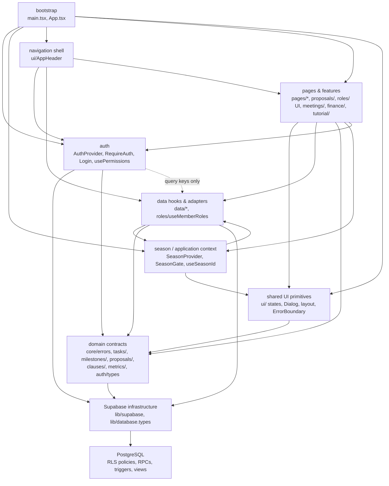

# Reqon architecture

How the code is split, which module owns what, and the guarantees each part
makes. Written from the code as of 2026-09-23; when this disagrees with the
code, the code wins — fix this file.

## 1. Layers and dependency direction

Arrows are runtime imports. `shell --> pages` is the header reading the
tutorial context (`tutorial/`). `domain --> infra` is type-only: the domain
aliases (`tasks/types.ts` and friends) name generated row types from
`lib/database.types.ts`, and `core/errors.ts` builds `DataError` from a
`PostgrestError`. Nothing imports "upward":

- no page, UI or feature component imports `lib/supabase.ts` — only `data/`,
  `auth/`, `roles/useMemberRoles.ts` and `main.tsx` do;
- `auth/` does not import `pages/` (the sign-in form lives in `auth/Login.tsx`);
- pure models (`pages/*/…Model.ts`, `tasks/taskState.ts`,
  `proposals/proposalStates.ts`) import domain types, never hook modules;
- Supabase's own `User`/`Session`/`AuthError`/`PostgrestError` stop at the
  `auth/` and `data/`/`core/` boundaries. Feature code sees
  `AuthenticatedUser` (`auth/types.ts`) and `DataError` (`core/errors.ts`).

`npx madge --circular --extensions ts,tsx src/main.tsx` reports no cycles.

**The database is the authorization boundary.** `usePermissions()`
(`auth/permissions.ts`) decides what the UI *offers*; RLS policies and the
RPCs' own checks decide what actually happens. Every rule is tested against a
real Postgres in `supabase/tests/`.

## 2. Season lifecycle

1. `SeasonProvider` runs one query, `useCurrentSeason()`, against the
   `v_current_season` view (`security_invoker`, so signed-out callers see
   nothing).
2. It exposes one of four states (`season/context.ts`): `loading`, `ready`
   (with `seasonId`), `no-current-season`, `failed`. A failed query is never
   shown as "no season" or as an empty list.
3. `SeasonGate` wraps every season-scoped route and renders loading / error
   (with retry) / "no current season, go to Settings" instead of the page.
   Settings is outside the gate — it is where a season gets created.
4. Hooks read the id with `useSeasonId()` (`undefined` unless `ready`).
   Season-scoped reads go through `useSeasonScopedQuery`, which will not fire
   without an id. Mutations take the id from the same boundary — never from a
   list query. Inserts refuse to write without one; edits address an existing
   row by its own id.
5. Switching is `set_current_season()` — one transaction. The partial unique
   index `seasons_one_current` makes a second current season impossible
   even for a caller bypassing the RPC.

`season_id` appears only in `src/data/` and `src/season/`; screens never
handle it.

## 3. Query-key strategy

All keys come from `data/queryKeys.ts`:

- **Season-scoped** tables and views: `['season', seasonId, <table>]`. The
  season id is high in the key, so `['season', id]` invalidates a whole
  season, and two seasons never share a cache entry — switching season reads
  a different key rather than overwriting the old one.
- **Global** reference data (`clauses`, `members`, `member_roles`,
  `subteams`, `meeting_template`, `seasons`, `currentSeason`) has flat keys.
- A key for an unresolved season uses the `'unknown'` bucket, but queries are
  disabled until the season is ready, so nothing is ever cached there.

Optimistic edits (`data/optimistic.ts`, used by task, proposal and
clause-status edits) snapshot only the row being edited. On failure they
revert only the fields that edit set, and only if nothing newer has changed
them since, so an older failing write cannot erase a newer overlapping one.
Every optimistic mutation invalidates its key when it settles, so the server
has the last word.

## 4. Transactional RPCs

Workflows that need more than one write are single SECURITY DEFINER
functions with `search_path` pinned, their own authorization check, and
EXECUTE granted to `authenticated` only:

| Function | Guarantees |
|---|---|
| `promote_proposal(proposal, season, owner, due, state)` | Admin only. Locks the proposal row; creates at most one task (backstopped by unique index `tasks_source_proposal_unique`) and marks the proposal decided in the same transaction. Idempotent: a repeat returns the existing task with `created = false`. Refuses a proposal from another season. |
| `apply_role_plan(changes jsonb)` | President or Developer only. Applies every grant/revoke in order, all or nothing. The last-president trigger still fires; if it refuses, the whole plan rolls back. |
| `set_current_season(season)` | Admin only. Clears the old current season and sets the new one in one transaction; a missing season id is refused and nothing changes. |

Single-row writes go straight through PostgREST under RLS. Because a refused
UPDATE/DELETE matches zero rows instead of failing, the hooks ask the
database (`is_admin`, `can_delete_records`, `can_manage_finances`, …) what a
zero-row result meant:
- not permitted: reported as a permission refusal (`DataError`, `permission: true`);
- row already gone: an edit reports "no longer exists", while a delete counts as done.

## 5. Realtime coverage

Exactly five tables are in the `supabase_realtime` publication, each with one
reviewed subscription (`data/useRealtime*.ts`, built on
`useSeasonRealtimeChannel` in `data/realtime.ts`):

| Table | Server-side filter | Cache effect |
|---|---|---|
| `clause_status` | `season_id` | patch the row in place |
| `tasks` | `season_id` | patch the row in place |
| `task_proposals` | `season_id` | patch the row in place |
| `specs` | `season_id` | invalidate (the screen reads the `spec_verdicts` view, which a raw row cannot rebuild) |
| `milestone_sections` | none (the table has no `season_id`) | invalidate the **current** season's sections query only; its refetch reads just that season's milestone keys |

One channel per (table, season), torn down on season change, sign-out and
unmount. Screens show the channel state (`connecting` / `live` / `off`).
Realtime delivers only rows the subscriber's RLS read policies allow.
`supabase/tests/season_and_platform_invariants_test.sql` asserts the
publication contains exactly these five tables.

## 6. Audit trail

`activity` is written only by SECURITY DEFINER triggers
(`20260114000000_activity_audit_trail.sql`); members can read it but cannot
insert, edit or delete rows. One row per meaningful transition:

| Table | Recorded when |
|---|---|
| `tasks` | `state` changes |
| `task_proposals` | `state` or `decision` changes |
| `member_roles` | a role is granted or removed |
| `milestones` | `due_on`, `opens_on` or `max_points` changes |
| `specs` | `measured` changes |
| `finance_entries` | any insert, update or delete |

Not recorded: every other column, bulk/seed inserts. `detail` holds only a
short list of named columns — never passwords, tokens, phone numbers or
free-text notes. Rows are kept until their season is deleted (cascade).
`supabase/tests/activity_audit_trail_test.sql` covers it.

## 7. Season export

`data/exportSeason.ts`, triggered from Settings → Season export, always for an
explicit season id (the current one):

- **Includes** the season's clause status, tasks, proposals, meetings,
  milestones and sections, specs, handover notes and activity, plus the
  roster's name/job title/status and the subteams, so ids resolve.
- **Excludes** anything from `auth` (emails, password hashes, sessions), phone
  numbers, private notes, the regulations book and the finance ledger.
- **Never truncates silently**: every collection is paged (`fetchAllRows`,
  past the 1,000-row `max_rows` cap) and then recounted in the database; if a
  count disagrees with the rows received, the export fails instead of
  producing a short file.
- **Limitation**: a best-effort paginated snapshot, not a transactional
  point-in-time backup. An edit landing mid-export makes the recount fail
  rather than produce an inconsistent file; retry.

## 8. Verification and CI

`.github/workflows/ci.yml` runs two independent jobs on every push to `main`
and every pull request:

| Job | Steps | Proves |
|---|---|---|
| `frontend` | `npm ci` → `npm ls --depth=0` → `npm audit --audit-level=high` → lint → typecheck → `npm run test:coverage` (coverage floors in `vite.config.ts`) → `npm run build` (incl. bundle budget) | toolchain, client behaviour, coverage floor, largest chunk ≤ 550 kB |
| `database` | `bash scripts/verify_db.sh` | a clean Postgres 17 + every migration + a real two-process race on `promote_proposal()` + every `supabase/tests/*.sql` file |

The SQL test files signal their verdict by raising an exception, which is also
what rolls their fixtures back. `verify_db.sh` accepts a file only if its
output contains exactly one error line and that line is its own
`… CHECKS PASSED — all N checks` verdict, so a failed setup step cannot hide
behind a passing block.
